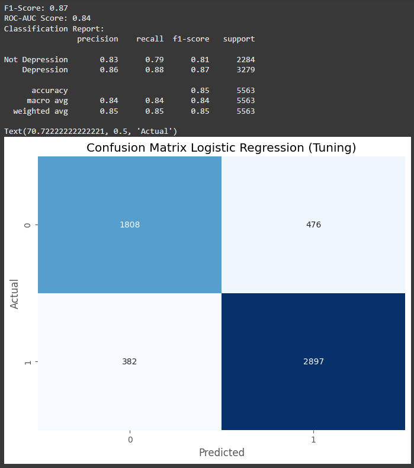

# Laporan Proyek Machine Learning

## Domain Proyek: Mental Health Analytics dalam Lingkungan Pendidikan

Kesehatan mental merupakan aspek penting dalam mendukung keberhasilan akademik dan kehidupan sosial siswa maupun mahasiswa. Dalam beberapa tahun terakhir, terdapat peningkatan signifikan terhadap kasus gangguan mental, khususnya depresi, di kalangan pelajar. Organisasi Kesehatan Dunia (WHO) melaporkan bahwa lebih dari 264 juta orang di dunia menderita depresi, dan sebagian besar kasus dimulai pada usia remaja dan dewasa muda – usia yang identik dengan masa sekolah dan kuliah.

Dalam konteks pendidikan tinggi, tekanan akademik, ekspektasi sosial, kesepian, gaya hidup yang tidak seimbang, dan masalah finansial merupakan pemicu utama gangguan psikologis. Menurut sebuah studi oleh American College Health Association (2021), lebih dari 40% mahasiswa di Amerika Serikat melaporkan mengalami gejala depresi dalam satu tahun terakhir. Hal serupa juga terjadi di Indonesia, sebagaimana diungkapkan oleh Kementerian Kesehatan RI, bahwa sekitar 6,1% remaja usia 15–24 tahun mengalami gangguan mental emosional, dan angka ini cenderung meningkat setiap tahunnya.

Meningkatnya prevalensi depresi pada pelajar menuntut adanya solusi berbasis teknologi untuk mengidentifikasi risiko secara dini. Pendekatan konvensional seperti konseling tatap muka atau survei manual sering kali bersifat reaktif, tidak efisien, dan sulit menjangkau semua siswa secara merata. Oleh karena itu, diperlukan pendekatan yang lebih sistematis dan prediktif dengan memanfaatkan machine learning dan analitik data.

**Referensi:**
- [World Health Organization. (2020). Depression](https://www.who.int/news-room/fact-sheets/detail/depression)
- [American College Health Association. (2021). ACHA-National College Health Assessment III](https://www.sjsu.edu/wellness/docs/ncha-spring-2021-executive-summary.pdf)
- [Kementerian Kesehatan RI. (2018). Laporan Nasional Riskesdas 2018](https://repository.badankebijakan.kemkes.go.id/id/eprint/3514/1/Laporan%20Riskesdas%202018%20Nasional.pdf)

## Business Understanding

### Problem Statements

1. Belum adanya sistem prediktif yang dapat mengidentifikasi siswa yang berisiko mengalami depresi
2. Kurangnya pemahaman terkait faktor-faktor utama yang memengaruhi kondisi mental siswa
3. Kebutuhan institusi pendidikan terhadap pendekatan berbasis data dalam pengambilan keputusan terkait kebijakan kesehatan mental masih belum terpenuhi

### Goals

1. Mengembangkan model prediktif untuk mengidentifikasi status depresi siswa berdasarkan data demografis, akademik, dan gaya hidup
2. Menentukan fitur atau faktor yang paling signifikan dalam memengaruhi risiko depresi
3. Memberikan rekomendasi berbasis data kepada institusi pendidikan untuk membantu dalam perancangan program intervensi dini kesehatan mental

### Solution Statements

1. Melakukan Exploratory Data Analysis (EDA) untuk memahami pola belajar, kebiasaan istirahat, gaya hidup, dan pengalaman siswa yang berkaitan dengan risiko depresi
2. Menerapkan dan membandingkan beberapa algoritma klasifikasi seperti `Logistic Regression`, `Decision Tree`, `Random Forest`, `KNN`, dan `XGBoost` untuk menemukan model prediktif terbaik
3. Mengevaluasi performa setiap model menggunakan metrik **F1-Score** dan **ROC AUC** guna memilih model yang paling seimbang antara precision dan recall

## Data Understanding

Dataset yang digunakan merupakan kumpulan data terkait kondisi kesehatan mental siswa, khususnya berfokus pada identifikasi kemungkinan depresi. Dataset ini bersifat publik dan dapat digunakan untuk penelitian edukasi maupun eksperimen machine learning.

- Jumlah data: 27.901 baris
- Jumlah fitur: 18 kolom (termasuk target)
- Tipe data: Gabungan antara 9 data numerik dan 9 data kategorikal
- Sumber data: [Student Depression Dataset on Kaggle](https://www.kaggle.com/datasets/adilshamim8/student-depression-dataset)

### Variabel-variabel pada Student Depression Dataset adalah sebagai berikut:

| No. | Nama Kolom | Deskripsi |
|-----|------------|-----------|
| 1 | `id` | ID unik untuk setiap responden |
| 2 | `Gender` | Jenis kelamin responden (`Male` atau `Female`) |
| 3 | `Age` | Usia responden dalam tahun |
| 4 | `City` | Kota atau lokasi tempat tinggal responden |
| 5 | `Profession` | Pekerjaan atau profesi responden (contoh: Mahasiswa, Engineer, dll) |
| 6 | `Academic Pressure` | Tingkat tekanan akademik yang dirasakan (skala numerik) |
| 7 | `Work Pressure` | Tingkat tekanan dari pekerjaan atau tugas akademik |
| 8 | `CGPA` | Indeks Prestasi Kumulatif (IPK) responden |
| 9 | `Study Satisfaction` | Tingkat kepuasan terhadap pengalaman belajar |
| 10 | `Job Satisfaction` | Tingkat kepuasan terhadap pekerjaan (jika ada) |
| 11 | `Sleep Duration` | Durasi tidur rata-rata (kategori: contoh: '5-6 hours', 'Less than 5 hours') |
| 12 | `Dietary Habits` | Pola makan responden (`Healthy`, `Moderate`, `Unhealthy`, atau `Others`) |
| 13 | `Degree` | Gelar pendidikan yang sedang ditempuh atau telah diperoleh |
| 14 | `Have you ever had suicidal thoughts ?` | Pernahkah responden memiliki pikiran untuk bunuh diri (`Yes` atau `No`) |
| 15 | `Work/Study Hours` | Rata-rata jam kerja atau belajar per hari |
| 16 | `Financial Stress` | Tingkat stres keuangan yang dirasakan (skala 1.0 – 5.0) |
| 17 | `Family History of Mental Illness` | Riwayat keluarga dengan gangguan mental (`Yes` atau `No`) |
| 18 | `Depression` | Variabel target: status depresi (`1` = Ya, `0` = Tidak) |

Dari hasil analisis awal deskripsi data, ditemukan bahwa kolom `id` hanya berisi nilai unik untuk setiap pelanggan dan **tidak memberikan kontribusi prediktif**, sehingga kolom ini akan **dihapus dari analisis**. Selain itu terdapat pula kolom `Financial Stress` yang bertipe data **object** yang seharusnya bertipe data **float**, sehingga perlu dilakukan konversi tipe data sebelum analisis lebih lanjut.

### Exploratory Data Analysis

#### Analisis Univariat

**1. Distribusi Data Target (Depression)**
 
<image src='image/distribusi_target.png' width= 500/>
 
Distribusi pada data target (Depression) sedikit **imbalance** (tidak seimbang), yang mungkin dapat menyebabkan model cenderung memprediksi kelas mayoritas. Oleh karena itu, untuk mengantisipasi permasalahan ini, akan dilakukan percobaan menggunakan teknik **oversampling** pada **data train** (*setelah proses pembagian data menjadi data latih dan data uji*).

**2. Distribusi Data Kategorikal**
 
<image src='image/distribusi_data_kategorik.png' width= 500/>
 
Berdasarkan distribusi nilai pada kolom-kolom kategorikal, ditemukan bahwa kolom `City` dan `Profession` memiliki beberapa kategori dengan jumlah data yang sangat sedikit (dominan pada satu kategori saja). Selain itu, kolom City juga memiliki terlalu banyak kategori, yang ***dapat menyebabkan curse of dimensionality***. Oleh karena itu, kedua kolom tersebut akan dihapus dari dataset.

Selain itu, pada kolom `Sleep Duration`, `Dietary Habits`, dan `Degree`, terdapat kategori bernilai "Others" yang tidak merepresentasikan informasi yang jelas serta jumlahnya sangat sedikit. Maka dari itu, baris data yang memiliki nilai "Others" pada fitur-fitur tersebut akan dihapus dari dataset.

**3. Distribusi Data Numerik**
 
<image src='image/distribusi_data_numerik.png' width= 500/>
<image src='image/boxplot_data_numerik.png' width= 500/>
  
Kolom `Work Pressure` dan `Job Satisfaction` juga menunjukkan dominasi pada satu nilai tertentu, sehingga tidak memberikan variasi yang signifikan untuk analisis. Oleh karena itu, kedua kolom tersebut akan dihapus dari dataset.

Sementara itu, kolom `Age` dan `CGPA` teridentifikasi memiliki nilai outlier yang dapat memengaruhi hasil analisis. Outlier pada kedua kolom tersebut akan dihapus pada tahap praproses selanjutnya.

#### Analisis Multivariat

**1. Distribusi Jenis Kelamin dan Pengaruhnya terhadap Status Depresi**
 
<image src='image/gender.png' width= 500/>
 
Baik pria maupun wanita memiliki proporsi yang hampir sama dalam hal mengalami depresi, dengan sekitar 58% dari masing-masing gender tercatat mengalami depresi. Persentase pria yang mengalami depresi sedikit lebih tinggi (58,62%) dibanding wanita (58,47%). Ini mengindikasikan bahwa dalam data ini, status depresi tidak terlalu dipengaruhi oleh perbedaan gender.

**2. Pengaruh Pemikiran Bunuh Diri Terhadap Status Depresi**
 
<image src='image/pemikiran_bunuh_diri.png' width= 500/>
 
Seperti yang dapat diduga, data menunjukkan bahwa responden yang memiliki pemikiran untuk melakukan bunuh diri memiliki kemungkinan jauh lebih besar untuk mengalami depresi.

**3. Pengaruh Tekanan Akademik Terhadap Status Depresi**
 
<image src='image/tekanan_akademik.png' width= 500/>
 
Tekanan akademik yang tinggi dapat menjadi salah satu faktor yang meningkatkan risiko seseorang mengalami depresi. Semakin besar beban dan stres yang dirasakan, semakin tinggi pula kemungkinan individu mengalami gangguan kesehatan mental seperti depresi.

**4. Umur Pelajar Dengan Kemungkinan Status Depresi**
 
<image src='image/umur.png' width= 500/>
  
Grafik menunjukkan bahwa responden dengan status depresi cenderung berusia lebih muda, dengan rata-rata usia 24 tahun, dibandingkan yang tidak depresi dengan rata-rata 27 tahun. Hal ini mengindikasikan bahwa depresi lebih banyak dialami oleh kelompok usia muda.

**5. Jam Belajar/Kerja dan Status Depresi**
 
<image src='image/waktu_belajar.png' width= 500/>
  
Responden dengan depresi memiliki rata-rata jam kerja/belajar lebih tinggi (7,81 jam) dibandingkan yang tidak depresi (6,24 jam). Ini mengindikasikan bahwa semakin banyak jam kerja/belajar, potensi mengalami depresi cenderung meningkat.

## Data Preparation

Pada tahap ini dilakukan proses transformasi pada data sehingga menjadi bentuk yang cocok untuk proses pemodelan. Beberapa tahap persiapan data yang dilakukan adalah:

### 1. Menangani Missing Values

Pada dataset terdapat missing value pada kolom `Financial Stress` sebanyak 3 data. Dikarenakan jumlahnya yang sedikit dan untuk menjaga keaslian data, maka diputuskan untuk menghapus baris-baris tersebut dari dataset.
 

### 2. Menghapus Outlier Values

Untuk menangani outlier, dilakukan penghapusan outlier pada kolom `Age` dan `CGPA` menggunakan metode IQR (Interquartile Range). Metode ini digunakan untuk menghilangkan nilai-nilai yang berada di luar batas bawah dan batas atas yang ditentukan, sehingga data menjadi lebih bersih dan representatif.
 

### 3. Encoding Fitur Kategori

Pada bagian ini, dilakukan transformasi data kategori (yang berbentuk teks atau label) menjadi format numerik agar dapat diproses oleh algoritma machine learning. Encoding fitur kategorikal dilakukan dalam 2 bagian:

1. **Label Encoding**: mengonversi nilai kategori menjadi angka integer (`0` dan `1`) untuk variabel biner seperti:
   - `Gender`
   - `Have you ever had suicidal thoughts ?`
   - `Family History of Mental Illness`

2. **One Hot Encoding**: mengubah setiap kategori menjadi kolom biner terpisah untuk data tidak terurut seperti:
   - `Sleep Duration`
   - `Dietary Habits`
   - `Degree`

 

### 4. Train-Test-Split

Data dibagi dengan proporsi 80:20, dimana 80% digunakan untuk training model dan 20% digunakan untuk testing model, untuk memastikan evaluasi yang objektif terhadap performa model.
 

### 5. Transformasi Fitur

Dilakukan scaling value dengan MinMaxScaler untuk menyamaratakan skala dari setiap fitur, sehingga tidak ada fitur yang mendominasi karena memiliki skala nilai yang lebih besar.
 

### 6. Menangani Data Imbalance

SMOTE (Synthetic Minority Over-sampling Technique) digunakan untuk mengatasi ketidakseimbangan kelas pada data latih. Pengujian juga dilakukan pada data tanpa SMOTE untuk membandingkan akurasi dan menilai efektivitas metode tersebut.
 

## Modeling

Pada tahap awal dilakukan pengujian untuk mencari algoritma terbaik tanpa melakukan hyperparameter tuning terlebih dahulu. Pengujian dilakukan pada data dengan SMOTE dan tanpa SMOTE.

 
 

Dari hasil pengujian, ditemukan bahwa model dengan SMOTE dan tanpa SMOTE memiliki akurasi yang hampir sama. Oleh karena itu, diputuskan untuk menggunakan model tanpa SMOTE karena data yang digunakan lebih orisinal dan merepresentasikan kondisi sebenarnya. 

Berdasarkan hasil evaluasi awal, fokus dilakukan pada 2 model algoritma dengan performa terbaik, yaitu:
1. Logistic Regression (F1 score 0.87)
2. XGBoost (F1 score 0.86)

### 1. XGBoost dengan Hyperparameter Tuning & Cross Validation

XGBoost (Extreme Gradient Boosting) adalah algoritma pembelajaran ensemble yang populer untuk tugas klasifikasi dan regresi. XGBoost bekerja dengan membangun model secara bertahap menggunakan pendekatan boosting, di mana setiap model baru berusaha untuk memperbaiki kesalahan dari model sebelumnya.

**Kelebihan XGBoost:**
- Performa tinggi pada berbagai jenis data
- Penanganan otomatis terhadap missing values
- Kemampuan menangani fitur numerik dan kategorikal
- Regularisasi bawaan untuk mencegah overfitting
- Implementasi paralel untuk komputasi lebih cepat

**Kekurangan XGBoost:**
- Membutuhkan tuning hyperparameter yang hati-hati
- Lebih kompleks dan sulit diinterpretasi dibandingkan model tradisional
- Memerlukan lebih banyak sumber daya komputasi

Untuk mendapatkan performa terbaik, dilakukan proses **hyperparameter tuning**, dan diperoleh parameter terbaik sebagai berikut:

**Best parameters XGBoost:**
- `subsample = 0.8`
- `reg_lambda = 2`
- `reg_alpha = 1`
- `n_estimators = 300`
- `max_depth = 3`
- `learning_rate = 0.1`
- `gamma = 5`
- `colsample_bytree = 0.6`

Hasil validasi menggunakan cross-validation dengan 5 fold menunjukkan:
- `accuracy`: 0.85
- `precision`: 0.86
- `recall`: 0.89
- `f1`: 0.87
- `roc_auc`: 0.92

### 2. Logistic Regression dengan Hyperparameter Tuning & Cross Validation

Logistic Regression adalah algoritma pembelajaran klasik yang masih efektif untuk tugas klasifikasi. Meskipun sederhana, Logistic Regression mampu memberikan hasil yang kompetitif, terutama pada data yang bersifat linier.

**Kelebihan Logistic Regression:**
- Mudah diimplementasikan dan diinterpretasi
- Efisien secara komputasional
- Memberikan probabilitas yang terkalibrasi dengan baik
- Bekerja baik dengan data berukuran besar dan fitur yang banyak

**Kekurangan Logistic Regression:**
- Kurang bisa menangkap relasi non-linear antar fitur
- Asumsi independensi antar fitur
- Sensitif terhadap outlier

Untuk optimalisasi model, dilakukan hyperparameter tuning dengan GridSearchCV, dan diperoleh parameter terbaik sebagai berikut:

**Best parameters Logistic Regression:**
- `solver = 'saga'`
- `penalty = 'elasticnet'`
- `l1_ratio = 0.9`
- `C = 0.1`
- `max_iter = 1000`

Hasil validasi menggunakan cross-validation dengan 5 fold menunjukkan:
- `accuracy`: 0.85
- `precision`: 0.85
- `recall`: 0.89
- `f1`: 0.87
- `roc_auc`: 0.92

### Pemilihan Model Terbaik

Dari kedua model yang telah dioptimalkan, **XGBoost** dipilih sebagai model terbaik dengan performa sebagai berikut (hasil validasi menggunakan cross-validation dengan 5 fold):
- `accuracy`: 0.85
- `precision`: 0.86
- `recall`: 0.89
- `f1`: 0.87
- `roc_auc`: 0.92

XGBoost dipilih karena:
1. Kemampuan lebih baik dalam menangkap pola kompleks dan interaksi antar fitur
2. Lebih robust terhadap variasi data dan noise
3. Memiliki performa yang konsisten pada validasi silang

## Evaluation

Untuk mengevaluasi kinerja model dalam mendeteksi risiko depresi pada mahasiswa, digunakan dua metrik utama, yaitu **F1 Score** dan **ROC AUC**. Pemilihan metrik ini disesuaikan dengan konteks permasalahan yang bersifat kelas tidak seimbang dan memiliki dampak serius jika terjadi kesalahan klasifikasi.

 

### F1 Score

F1 Score merupakan metrik yang menggabungkan **Precision** dan **Recall** dalam satu nilai harmonis, dengan formula:

F1 = 2 × (Precision × Recall) / (Precision + Recall)

dimana:
- **Precision**: Persentase prediksi positif yang benar-benar positif. Precision = TP / (TP + FP)
- **Recall**: Persentase kasus positif yang berhasil diprediksi sebagai positif. Recall = TP / (TP + FN)

F1 Score sangat cocok digunakan ketika keseimbangan antara False Positive dan False Negative penting untuk dipertahankan, seperti dalam kasus prediksi depresi. Nilai F1 Score sebesar **0.87** menunjukkan bahwa model mampu menjaga keseimbangan yang baik antara presisi dalam mendeteksi depresi dan sensitivitas dalam menjangkau kasus yang benar-benar positif.

### ROC AUC (Receiver Operating Characteristic - Area Under Curve)

ROC AUC mengukur kemampuan model dalam membedakan antara kelas positif (depresi) dan negatif (tidak depresi) di berbagai ambang batas prediksi. Nilai AUC berkisar antara 0 hingga 1.

Dengan skor **ROC AUC sebesar 0.84**, model XGBoost menunjukkan kinerja yang sangat baik dalam membedakan mahasiswa yang mengalami gejala depresi dan yang tidak.

Berdasarkan hasil confusion matrix, model XGBoost menunjukkan kemampuan yang baik dalam mengidentifikasi kasus depresi (recall tinggi), yang sangat penting dalam konteks kesehatan mental di mana melewatkan kasus positif (false negative) bisa berdampak serius.

### Feature Importance & Business Insight

Analisis feature importance dari model XGBoost menunjukkan beberapa faktor kunci yang berpengaruh terhadap depresi di kalangan pelajar:

 

1. **Pikiran Bunuh Diri** - Menjadi faktor paling berpengaruh dan perlu menjadi indikator prioritas intervensi
2. **Tekanan Akademik & Stres Finansial** - Pemicu kuat gangguan mental
3. **Jam Belajar/Bekerja Berlebihan** - Terkait dengan peningkatan risiko stres dan burnout
4. **Pola Makan Tidak Sehat** - Berkontribusi negatif terhadap kesehatan mental
5. **Kepuasan Studi Tinggi** - Faktor yang menurunkan risiko depresi
6. **Usia Muda** - Kelompok yang lebih rentan mengalami gangguan emosional

Berdasarkan temuan ini, beberapa rekomendasi strategis yang dapat diberikan kepada institusi pendidikan meliputi:

- Membangun sistem deteksi dini dan layanan konseling prioritas untuk mengidentifikasi pikiran bunuh diri
- Evaluasi beban studi dan penyelenggaraan pelatihan manajemen stres untuk mengurangi tekanan akademik
- Penawaran beasiswa, konseling keuangan, dan program kerja paruh waktu untuk memitigasi stres finansial
- Fokus intervensi pada mahasiswa baru dan kelompok usia 18-21 tahun
- Pengaturan beban studi yang seimbang dan promosi waktu istirahat yang cukup
- Program promosi pola hidup sehat dengan kegiatan olahraga rutin
- Peningkatan kualitas pembelajaran dan perhatian terhadap feedback mahasiswa

Model prediktif yang dikembangkan terbukti efektif dalam mengidentifikasi risiko depresi secara akurat dan andal, sehingga dapat mendukung upaya deteksi dini gangguan mental pada kalangan pelajar dan memungkinkan intervensi yang lebih cepat dan tepat sasaran.

## Referensi
1. World Health Organization. (2020). Depression. Retrieved from: https://www.who.int/news-room/fact-sheets/detail/depression
2. American College Health Association. (2021). ACHA-National College Health Assessment III: Undergraduate Student Reference Group Executive Summary Spring 2021.Retrieved from: https://www.sjsu.edu/wellness/docs/ncha-spring-2021-executive-summary.pdf
3. Kementerian Kesehatan RI. (2018). Laporan Nasional Riskesdas 2018. Badan Penelitian dan Pengembangan Kesehatan, Kemenkes RI. Retrieved from: https://repository.badankebijakan.kemkes.go.id/id/eprint/3514/1/Laporan%20Riskesdas%202018%20Nasional.pdf
4. https://medium.com/@andimrinaldisaputraa/memahami-dan-menerapkan-matriks-evaluasi-roc-auc-dalam-machine-learning-4468e5fcb9a