# Laporan Proyek Machine Learning 

## 🧠 Domain Proyek: Mental Health Analytics dalam Lingkungan Pendidikan

### Latar Belakang

Kesehatan mental merupakan aspek penting dalam mendukung keberhasilan akademik dan kehidupan sosial siswa maupun mahasiswa. Dalam beberapa tahun terakhir, terdapat peningkatan signifikan terhadap kasus gangguan mental, khususnya depresi, di kalangan pelajar. Organisasi Kesehatan Dunia (WHO) melaporkan bahwa lebih dari 264 juta orang di dunia menderita depresi, dan sebagian besar kasus dimulai pada usia remaja dan dewasa muda – usia yang identik dengan masa sekolah dan kuliah (World Health Organization, 2020).

Dalam konteks pendidikan tinggi, tekanan akademik, ekspektasi sosial, kesepian, gaya hidup yang tidak seimbang, dan masalah finansial merupakan pemicu utama gangguan psikologis. Menurut sebuah studi oleh American College Health Association (2021), lebih dari 40% mahasiswa di Amerika Serikat melaporkan mengalami gejala depresi dalam satu tahun terakhir. Hal serupa juga terjadi di Indonesia, sebagaimana diungkapkan oleh Kementerian Kesehatan RI, bahwa sekitar 6,1% remaja usia 15–24 tahun mengalami gangguan mental emosional, dan angka ini cenderung meningkat setiap tahunnya (Riskesdas, 2018).

Meningkatnya prevalensi depresi pada pelajar menuntut adanya solusi berbasis teknologi untuk mengidentifikasi risiko secara dini. Namun, pendekatan konvensional seperti konseling tatap muka atau survei manual sering kali bersifat reaktif, tidak efisien, dan sulit menjangkau semua siswa secara merata. Oleh karena itu, diperlukan pendekatan yang lebih sistematis dan prediktif dengan memanfaatkan machine learning dan analitik data.

## Business Understanding

### 🔍 Problem Statement (Pernyataan Masalah)
1. Belum adanya sistem prediktif yang dapat mengidentifikasi siswa yang berisiko mengalami depresi
2. Kurangnya pemahaman terkait faktor-faktor utama** yang memengaruhi kondisi mental siswa
3. Kebutuhan institusi pendidikan terhadap pendekatan berbasis data, dalam pengambilan keputusan terkait kebijakan kesehatan mental masih belum terpenuhi

### Goals
1. Mengembangkan model prediktif untuk mengidentifikasi status depresi siswa berdasarkan data demografis, akademik, dan gaya hidup.
2. Menentukan fitur atau faktor yang paling signifikan dalam memengaruhi risiko depresi.
3. Memberikan rekomendasi berbasis data kepada institusi pendidikan untuk membantu dalam perancangan program intervensi dini kesehatan mental

### Solution Statement
1. Melakukan Exploratory Data Analysis (EDA) untuk memahami pola belajar, kebiasaan istirahat, gaya hidup, dan pengalaman siswa yang berkaitan dengan risiko depresi.
2. Menerapkan dan membandingkan beberapa algoritma klasifikasi seperti `Logistic Regression`, `Decision Tree`, `Random Forest`, `KNN`, dan `XGBoost` untuk menemukan model prediktif terbaik.
3. Mengevaluasi performa setiap model menggunakan metrik **F1-Score** dan **ROC AUC** guna memilih model yang paling seimbang antara precision dan recall.

## Data Understanding
Dataset yang digunakan merupakan kumpulan data terkait kondisi kesehatan mental siswa, khususnya berfokus pada identifikasi kemungkinan depresi. Dataset ini bersifat publik dan dapat digunakan untuk penelitian edukasi maupun eksperimen machine learning.
- Jumlah data: 1.000 baris
- Jumlah fitur: 18 kolom (termasuk target)
- Tipe data: Gabungan antara 9 data numerik dan 9 data kategorikal
- Sumber data: https://www.kaggle.com/datasets/adilshamim8/student-depression-dataset

### Deskripsi Fitur Data
| No. | Nama Kolom                                 | Deskripsi                                                                 |
|-----|---------------------------------------------|---------------------------------------------------------------------------|
| 1   | `id`                                        | ID unik untuk setiap responden                                            |
| 2   | `Gender`                                    | Jenis kelamin responden (`Male` atau `Female`)                            |
| 3   | `Age`                                       | Usia responden dalam tahun                                                |
| 4   | `City`                                      | Kota atau lokasi tempat tinggal responden                                 |
| 5   | `Profession`                                | Pekerjaan atau profesi responden (contoh: Mahasiswa, Engineer, dll)       |
| 6   | `Academic Pressure`                         | Tingkat tekanan akademik yang dirasakan (skala numerik)                   |
| 7   | `Work Pressure`                             | Tingkat tekanan dari pekerjaan atau tugas akademik                        |
| 8   | `CGPA`                                      | Indeks Prestasi Kumulatif (IPK) responden                                 |
| 9   | `Study Satisfaction`                        | Tingkat kepuasan terhadap pengalaman belajar                              |
| 10  | `Job Satisfaction`                          | Tingkat kepuasan terhadap pekerjaan (jika ada)                            |
| 11  | `Sleep Duration`                            | Durasi tidur rata-rata (kategori: contoh: '5-6 hours', 'Less than 5 hours')|
| 12  | `Dietary Habits`                            | Pola makan responden (`Healthy`, `Moderate`, `Unhealthy`, atau `Others`)  |
| 13  | `Degree`                                    | Gelar pendidikan yang sedang ditempuh atau telah diperoleh                |
| 14  | `Have you ever had suicidal thoughts ?`     | Pernahkah responden memiliki pikiran untuk bunuh diri (`Yes` atau `No`)   |
| 15  | `Work/Study Hours`                          | Rata-rata jam kerja atau belajar per hari                                 |
| 16  | `Financial Stress`                          | Tingkat stres keuangan yang dirasakan (skala 1.0 – 5.0)                   |
| 17  | `Family History of Mental Illness`          | Riwayat keluarga dengan gangguan mental (`Yes` atau `No`)                 |
| 18  | `Depression`                                | Variabel target: status depresi (`1` = Ya, `0` = Tidak)                   |

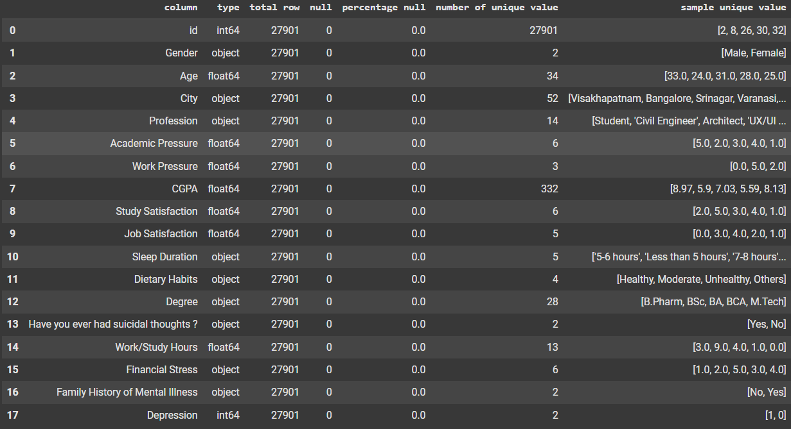

Kolom `CustomerID` hanya berisi nilai unik untuk setiap pelanggan dan **tidak memberikan kontribusi prediktif**, sehingga kolom ini akan **dihapus dari analisis**.

Selain itu terdapat pula kolom `Financial Stress` yang bertipe data **object** yang seharusnya bertipe data **float**, sehingga perlu dilakukan konversi tipe data sebelum analisis lebih lanjut.

### Univariate Analysis

- Melihat Persebaran Data pada Target
     
    <image src='image/distribusi_target.png' width= 500/>
      
    Distribusi pada data target (Depression) sedikit **imbalance** (tidak seimbang), yang mungkin dapat menyebabkan model cenderung memprediksi kelas mayoritas. Oleh karena itu, untuk mengantisipasi permasalahan ini, akan dilakukan percobaan menggunakan teknik **oversampling** pada **data train** (*setelah proses pembagian data menjadi data latih dan data uji*).

- Melihat Persebaran Data pada Setiap Kolom Kategorikal
     
    <image src='image/distribusi_data_kategorik.png' width= 500/>
      
    Berdasarkan distribusi nilai pada kolom-kolom kategorikal, ditemukan bahwa kolom `City` dan `Profession` memiliki beberapa kategori dengan jumlah data yang sangat sedikit (dominan pada satu kategori saja). Selain itu, kolom City juga memiliki terlalu banyak kategori, yang ***dapat menyebabkan curse of dimensionality***. Oleh karena itu, kedua kolom tersebut akan dihapus dari dataset.

    Selain itu, pada kolom `Sleep Duration`, `Dietary Habits`, dan `Degree`, terdapat kategori bernilai "Others" yang tidak merepresentasikan informasi yang jelas serta jumlahnya sangat sedikit. Maka dari itu, baris data yang memiliki nilai "Others" pada fitur-fitur tersebut akan dihapus dari dataset.

- Melihat Persebaran Data pada Setiap Kolom Numerikal
     
    <image src='image/distribusi_data_numerik.png' width= 500/>
    <image src='image/boxplot_data_numerik.png' width= 500/>
       
    Kolom `Work Pressure` dan `Job Satisfaction` juga menunjukkan dominasi pada satu nilai tertentu, sehingga tidak memberikan variasi yang signifikan untuk analisis. Oleh karena itu, kedua kolom tersebut akan dihapus dari dataset.  
    
    Sementara itu, kolom `Age` dan `CGPA` teridentifikasi memiliki nilai outlier yang dapat memengaruhi hasil analisis. Outlier pada kedua kolom tersebut akan dihapus pada tahap praproses selanjutnya.

### Multivariate Analysis 
- Persentase Distribusi Jenis Kelamin Secara Keseluruhan
     
    <image src='image/gender.png' width= 500/>
      
    baik pria maupun wanita memiliki proporsi yang hampir sama dalam hal mengalami depresi, dengan sekitar 58% dari masing-masing gender tercatat mengalami depresi. Persentase pria yang mengalami depresi sedikit lebih tinggi (58,62%) dibanding wanita (58,47%). Sementara itu, sekitar 41% dari masing-masing gender tidak mengalami depresi. Hal ini mengindikasikan bahwa dalam data ini, status depresi tidak terlalu dipengaruhi oleh perbedaan gender.

- Persentase Pemikiran Bunuh Diri Pada Pelajar
     
    <image src='image/pemikiran_bunuh_diri.png' width= 500/>
      
    Seperti yang kita bayangkan apabila seseorang sampai memiliki pemikiran untuk melakukan bunuh diri, semakin besar pula kemungkinan orang tersebut mengalami depresi.

- Tekanan Akademik Terhadap Tingkat Depresi Pelajar
     
    <image src='image/tekanan_akademik.png' width= 500/>
      
    Seperti yang kita bayangkan, tekanan akademik yang tinggi dapat menjadi salah satu faktor yang meningkatkan risiko seseorang mengalami depresi. Semakin besar beban dan stres yang dirasakan, semakin tinggi pula kemungkinan individu mengalami gangguan kesehatan mental seperti depresi.
    
- Umur Terhadap Tingkat Depresi Pelajar
     
    <image src='image/umur.png' width= 500/>
      
    Grafik menunjukkan bahwa customer dengan status depresi cenderung berusia lebih muda, dengan rata-rata usia 24 tahun, dibandingkan yang tidak depresi dengan rata-rata 27tahun. Hal ini mengindikasikan bahwa depresi lebih banyak dialami oleh kelompok usia muda.

- Lamanya Waktu Belajar
     
    <image src='image/waktu_belajar.png' width= 500/>
      
    Grafik menunjukkan bahwa customer dengan depresi memiliki rata-rata jam kerja/belajar lebih tinggi (7,81 jam) dibandingkan yang tidak depresi (6,24 jam). Ini mengindikasikan bahwa semakin banyak jam kerja/belajar, potensi mengalami depresi cenderung meningkat.

## Data Data Preparation

Pada tahap ini kita akan melakukan proses transformasi pada data sehingga menjadi bentuk yang cocok untuk proses pemodelan. Ada beberapa tahap persiapan data perlu dilakukan, yaitu:
1. Menangani Missing Values
2. Menghapus Outlier Values
3. Encoding Fitur Kategori
4. Spliting Data Train dan Test
5. Transformasi Fitur
6. Menangani Data Imbalance

### Menangani Missing Values
Pada tahap ini dikarenakan missing value hanya terdapat 3 value pada kolom `Financial Stress` maka kita akan menghapus kolom tersebut. Karena hanya terdapat 3 value pada kolom tersebut maka kita akan menghapus kolom tersebut, dikarenakan agar menjaga keaslian data.

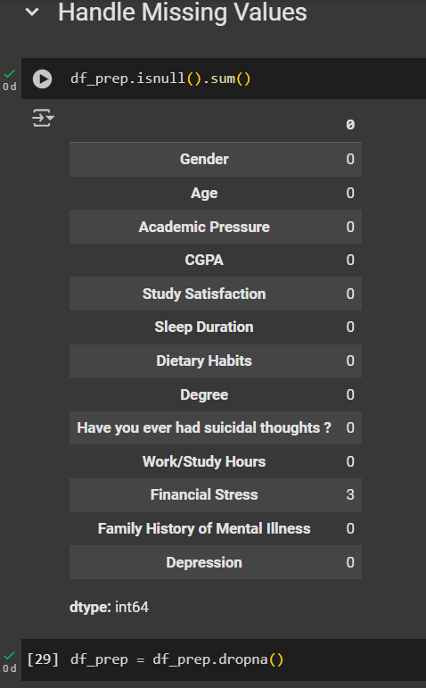 

### Menghapus Outlier Values
Untuk menangani outlier, kali ini akan dilakukan penghapusan outlier pada kolom `Age` dan `CGPA` menggunakan metode IQR. Metode ini digunakan untuk menghilangkan nilai-nilai yang berada di luar batas bawah dan batas atas yang ditentukan, sehingga data menjadi lebih bersih dan representatif.

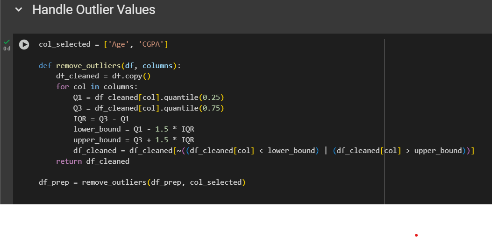 

### Encoding Fitur Kategori
Pada bagian ini, karena dataset fitur kategori kita sebelumnya sudah diubah dalam bentuk objek (string) pada tahap eksplorasi data analis maka kita perlu mengubah data kategori (yang berbentuk teks atau label) menjadi format numerik agar dapat diproses oleh algoritma machine learning. Encoding Fitur Kategorikal dilakukan 2 bagian, yakni:

1. *Label Encoding* yaitu, mengonversi nilai kategori menjadi angka integer (`0` dan `1`). Variabel yang akan diproses yakni:   
    `Gender`, `Have you ever had suicidal thoughts ?`, `Family History of Mental Illness`
2. *One Hot Ecoding* yaitu mengubah setiap kategori menjadi kolom biner terpisah untuk data tidak terurut. Variabel yang akan diproses yakni:  
    `Sleep Duration`, `Dietary Habits`, `Degree`
Hasil setelah dilakukan data preprocessing dapat dilihat pada gambar berikut:

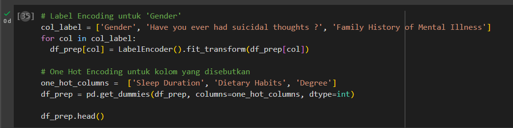 

### Train-Test-Split
Membagi data dengan proporsi 80:20. Dengan 80% digunakan untuk training model dan 20% digunakan untuk testing model.

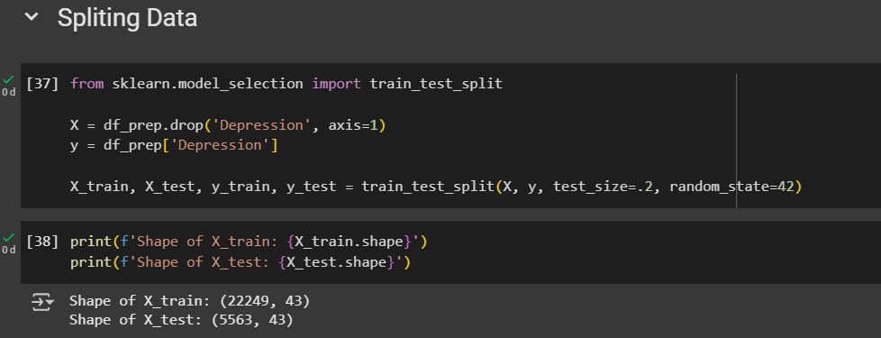 

### Transformasi Fitur
Melakukan scaling value dengam MinMaxScaler untuk menyamaratakan scalar dari setiap fitur.

 

### Balancing Data
SMOTE digunakan untuk mengatasi ketidakseimbangan kelas pada data latih. Pengujian juga dilakukan pada data tanpa SMOTE untuk membandingkan akurasi dan menilai efektivitas metode tersebut.

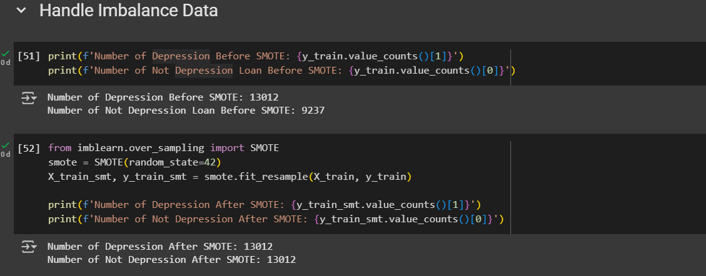 

## Modeling
Pada tahap awal dilakukannya pengetesan untuk mencari algoritma yang terbaik tanpa melakukan hyperparameter tuning terlebih dahulu dan di tes pada data smote dan tidak smote.

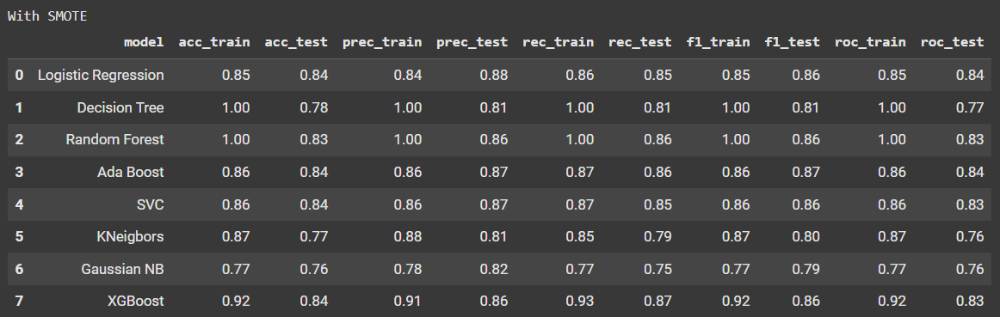 
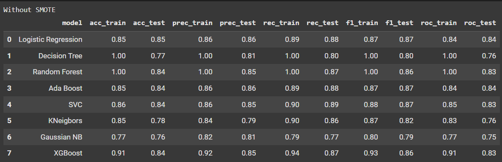 

Dari kedua hasil tersebut, dapat dilihat bahwa model dengan SMOTE dan tanpa SMOTE memiliki akurasi yang sama. Oleh karena itu, digunakan model tanpa SMOTE karena data yang digunakan lebih orisinal dan merepresentasikan kondisi sebenarnya. Selanjutnya akan fokus terhadap 2 model algoritma yaitu Logistic regression dan XGBoost. Kedua model tersebut memiliki akurasi yang paling baik dengan F1 score sebesar 0.87 pada Logistic Regression dan 0.86 pada XGBoost.

### 1. Hyperparameter Tuning & Cross Validation XGBoost

Algoritma pembelajaran ensemble yang sangat populer untuk tugas klasifikasi dan regresi adalah **XGBoost** (*Extreme Gradient Boosting*). XGBoost bekerja dengan membangun model secara bertahap menggunakan pendekatan boosting, di mana setiap model baru berusaha untuk memperbaiki kesalahan dari model sebelumnya. Metode ini dikenal karena kemampuannya dalam menghasilkan performa yang tinggi serta mengurangi risiko overfitting.

Pada pemodelan ini, *XGBoost* diimplementasikan menggunakan `XGBClassifier` dari library `xgboost`, dengan melatih model menggunakan `X_train` dan `y_train`, serta menguji performa menggunakan `X_test` dan `y_test`. Untuk mendapatkan performa terbaik, dilakukan proses *hyperparameter tuning*, dan diperoleh parameter terbaik sebagai berikut:

> **Best parameters**:  
`subsample = 0.8`,  
`reg_lambda = 2`,  
`reg_alpha = 1`,  
`n_estimators = 300`,  
`max_depth = 3`,  
`learning_rate = 0.1`,  
`gamma = 5`,  
`colsample_bytree = 0.6`

Hasil validasi menggunakan *cross-validation* menunjukkan bahwa model XGBoost memiliki performa yang cukup baik, dengan skor sebagai berikut:

> **Cross Validation Scores (mean of 5 folds):**  
`accuracy`: 0.85  
`precision`: 0.86  
`recall`: 0.89  
`f1`: 0.87  
`roc_auc`: 0.92

### 2. Hyperparameter Tuning & Cross Validation Logistic Regression

Algoritma pembelajaran klasik yang masih sangat efektif untuk tugas klasifikasi adalah **Logistic Regression**. Meskipun sederhana, Logistic Regression mampu memberikan hasil yang kompetitif, terutama pada data yang bersifat linier. Algoritma ini bekerja dengan memodelkan probabilitas kejadian dari suatu kelas menggunakan fungsi logistik (sigmoid), dan banyak digunakan karena interpretabilitas serta efisiensinya.

Pada pemodelan ini, *Logistic Regression* diimplementasikan menggunakan `LogisticRegression` dari library `sklearn.linear_model`, dengan melatih model menggunakan `X_train` dan `y_train`, serta menguji performa pada `X_test` dan `y_test`. Untuk mendapatkan hasil yang optimal, dilakukan proses *hyperparameter tuning* menggunakan GridSearchCV, dan diperoleh parameter terbaik sebagai berikut:

> **Best parameters**:  
`solver = 'saga'`,  
`penalty = 'elasticnet'`,  
`l1_ratio = 0.9`,  
`C = 0.1`,  
`max_iter = 1000`

Dengan konfigurasi tersebut, model dapat memanfaatkan kombinasi regularisasi L1 dan L2 secara seimbang, serta stabil dalam proses konvergensi.

> **Cross Validation Scores (mean of 5 folds):**  
`accuracy`: 0.85  
`precision`: 0.85  
`recall`: 0.89  
`f1`: 0.87  
`roc_auc`: 0.92

### Result 
Dari kedua model tersebut XGBoost memiliki performa yang lebih baik, dengan skor sebagai berikut:
`accuracy`: 0.85  
`precision`: 0.86  
`recall`: 0.89  
**`f1`: 0.87**  
**`roc_auc`: 0.92**

dan memiliki confusion matrix sebagai berikut:
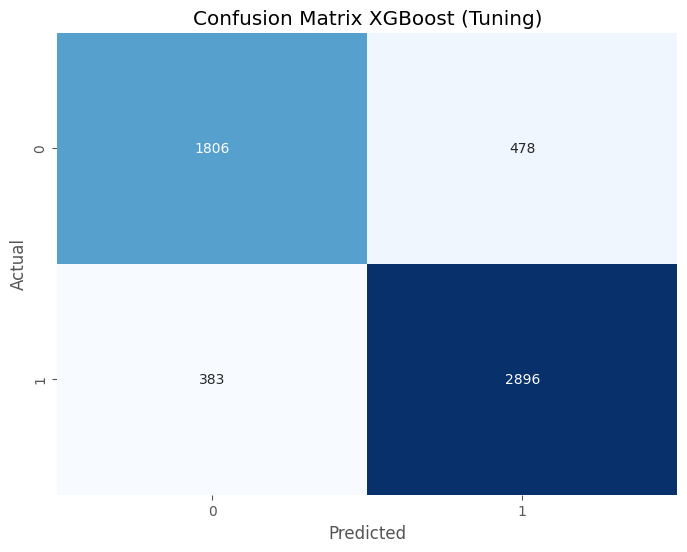 

## Evaluation
Untuk mengevaluasi kinerja model dalam mendeteksi risiko depresi pada mahasiswa, digunakan dua metrik utama, yaitu **F1 Score** dan **ROC AUC**. Pemilihan metrik ini disesuaikan dengan konteks permasalahan yang bersifat **kelas tidak seimbang** dan memiliki dampak serius jika terjadi kesalahan klasifikasi, khususnya dalam mengidentifikasi individu yang mengalami depresi.

### **F1 Score**

F1 Score merupakan metrik yang menggabungkan **Precision** dan **Recall** dalam satu nilai harmonis. Rumusnya adalah:

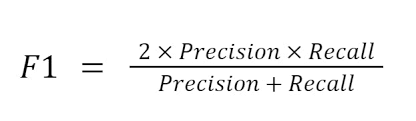

Metrik ini sangat cocok digunakan ketika keseimbangan antara False Positive dan False Negative penting untuk dipertahankan, seperti dalam kasus prediksi depresi. Nilai F1 Score sebesar **0.87** menunjukkan bahwa model mampu menjaga keseimbangan yang baik antara presisi dalam mendeteksi depresi dan sensitivitas dalam menjangkau kasus yang benar-benar positif.

### **ROC AUC (Receiver Operating Characteristic - Area Under Curve)**

ROC AUC mengukur kemampuan model dalam membedakan antara kelas positif (depresi) dan negatif (tidak depresi) di berbagai ambang batas prediksi. Nilai **AUC** berkisar antara 0 hingga 1, di mana semakin mendekati 1, semakin baik performa model. Dengan skor **ROC AUC sebesar 0.92**, model menunjukkan kinerja yang sangat baik dalam membedakan mahasiswa yang mengalami gejala depresi dan yang tidak.

### **Kesimpulan Evaluasi**

Dengan skor **F1: 0.87** dan **ROC AUC: 0.92**, model yang dibangun terbukti efektif dalam mengidentifikasi risiko depresi secara akurat dan andal. Hal ini menunjukkan bahwa pendekatan machine learning dapat menjadi solusi prediktif yang mendukung upaya deteksi dini gangguan mental pada kalangan pelajar, sehingga memungkinkan intervensi lebih cepat dan tepat sasaran.

## Feature Importance & Business Insight
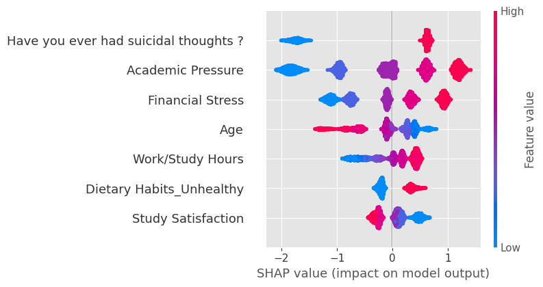 

Gangguan mental seperti depresi meningkat di kalangan pelajar dan mahasiswa. Pendekatan konvensional kurang efektif, sehingga dibutuhkan solusi prediktif berbasis teknologi.

**Temuan Utama (dari SHAP Analysis):**

- **Pikiran Bunuh Diri** → Faktor paling berpengaruh. Perlu jadi indikator prioritas intervensi.  
- **Tekanan Akademik & Stres Finansial** → Pemicu kuat gangguan mental.  
- **Jam Belajar/Bekerja Berlebihan** → Terkait dengan peningkatan risiko stres dan burnout.  
- **Pola Makan Tidak Sehat** → Berkontribusi negatif terhadap kesehatan mental.  
- **Kepuasan Studi Tinggi** → Menurunkan risiko depresi.  
- **Usia Muda** → Lebih rentan mengalami gangguan emosional.

**Rekomendasi Strategis:**

- Pikiran Bunuh Diri
Buat sistem deteksi dini dan layanan konseling prioritas.
- Tekanan Akademik
Evaluasi beban studi & adakan pelatihan manajemen stres.
- Stres Finansial
Tawarkan beasiswa, konseling keuangan, dan kerja paruh waktu.
- Usia Muda (Remaja Awal)
Fokus intervensi pada mahasiswa baru dan usia 18–21 tahun.
- Jam Belajar/Bekerja Tinggi
Atur beban studi agar seimbang, dorong waktu istirahat.
- Pola Hidup Tidak Sehat
Menjaga pola hidup sehat dengan mengadakan kegiatan olahraga ditiap minggunya.
- Kepuasan Studi
Tingkatkan kualitas pembelajaran & perhatikan feedback mahasiswa.

## Referensi
1. World Health Organization. (2020). Depression. Retrieved from: https://www.who.int/news-room/fact-sheets/detail/depression
2. American College Health Association. (2021). ACHA-National College Health Assessment III: Undergraduate Student Reference Group Executive Summary Spring 2021.Retrieved from: https://www.sjsu.edu/wellness/docs/ncha-spring-2021-executive-summary.pdf
3. Kementerian Kesehatan RI. (2018). Laporan Nasional Riskesdas 2018. Badan Penelitian dan Pengembangan Kesehatan, Kemenkes RI. Retrieved from: https://repository.badankebijakan.kemkes.go.id/id/eprint/3514/1/Laporan%20Riskesdas%202018%20Nasional.pdf
4. https://medium.com/@andimrinaldisaputraa/memahami-dan-menerapkan-matriks-evaluasi-roc-auc-dalam-machine-learning-4468e5fcb9a

